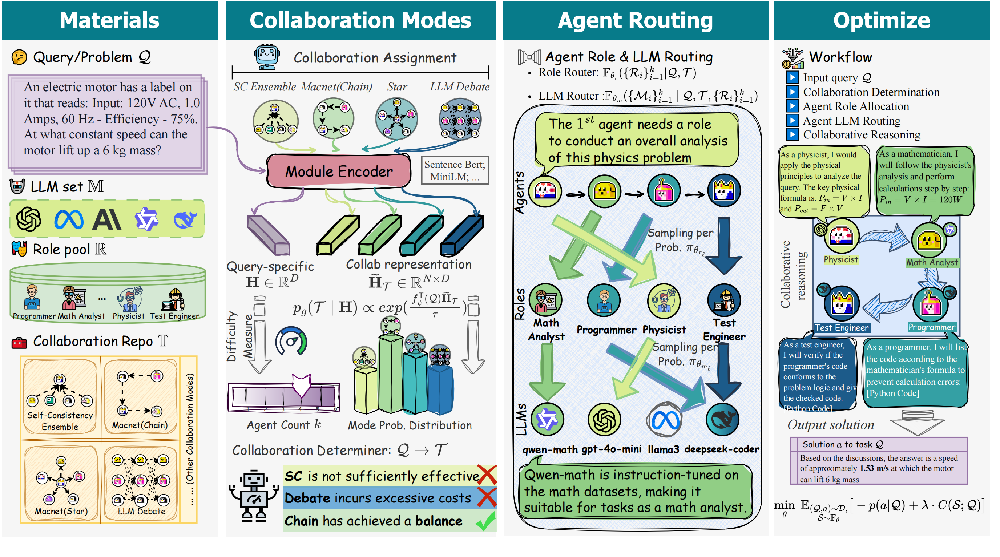

# Error-Augmented MAS Routing: Improving Multi-Agent Systems with Step-Level Error Signals

> **Can step-level error analysis and error propagation signals improve the routing decisions of a multi-agent system?**

🚧 **Work in progress** — preliminary results on GSM8K below; experiments on additional benchmarks are ongoing.

This repository extends [MasRouter](https://arxiv.org/abs/2502.11133) (ACL 2025) with **error-aware reward shaping** derived from the [MAST](https://github.com/microsoft/MAST) error taxonomy. By penalizing routing configurations that produce step-level errors — especially those that **propagate across agents** — the controller learns to select more robust collaboration topologies, roles, and LLMs.

<p align="center">
  
</p>

---

## 💡 Key Idea

Standard MAS routing optimizes for **task success** and **cost**. We add a third signal — **error penalty** — computed by an LLM judge that labels step-level errors in each execution trace using a 28-type codebook:

$$\text{utility} = \underbrace{\text{is\\_solved}}_{\text{task success}} \;-\; \underbrace{\beta \cdot \text{cost}}_{\text{efficiency}} \;-\; \underbrace{\gamma \cdot \text{error\\_penalty}}_{\text{robustness}}$$

The error penalty uses **propagation-aware weighting**: source errors (root causes) receive full weight, while propagated errors are discounted (×0.3), focusing the gradient on the routing decisions that *cause* errors rather than the ones that merely inherit them.

Per-agent **counterfactual credit assignment** decomposes the penalty so each role/LLM selection receives its own gradient signal via REINFORCE.

---

## 📊 Preliminary Results (GSM8K)

### Accuracy vs Error Reduction across γ

| γ | Judge | Accuracy | Total Errors | Samples w/ Errors | Propagation Edges | Cost ($) |
|:---:|:---:|:---:|:---:|:---:|:---:|:---:|
| 0 (baseline) | gpt-4o-mini | 94.89% | 274 | 197 (18.7%) | 95 | 0.93 |
| 0.1 | gpt-4o-mini | 94.98% | 194 | 149 (14.1%) | 57 | 0.97 |
| 0.2 | gpt-4o-mini | 94.89% | 222 | 172 (16.3%) | 72 | 1.03 |
| **0.4** | **gpt-4o-mini** | **94.98%** | **172** | **128 (12.1%)** | **54** | **1.09** |
| 0.8 | gpt-4o-mini | 94.41% | 224 | 176 (16.7%) | 73 | 1.07 |
| 1.6 | gpt-4o-mini | 94.32% | 177 | 123 (11.6%) | 67 | 0.89 |
| 0.2 | gpt-5-mini | 94.98% | 237 | 128 (12.1%) | 89 | 0.98 |

> **Best setting (γ=0.4):** **−37.2%** total errors, **−43.2%** propagation edges, no accuracy loss (+0.09 pp), at +17.7% cost overhead.

### Behavioral Shifts

The error penalty causes the controller to make qualitatively different routing decisions:

| Behavior | Baseline (γ=0) | Ours (γ=0.4) |
|---|---|---|
| **LLM routing** | Llama 70B: 30.2%, DeepSeek: 4.7% | Llama 70B: 7.2%, DeepSeek: 28.3% |
| **Collaboration topology** | Independent (IO/CoT): 92.3% | Independent: 54.5%, Structured: 45.5% |
| **Error propagation** | 76 samples, 95 edges | 43 samples, 54 edges |

The controller learns to **avoid error-prone LLMs** (Llama 70B: 30% → 7%) and **prefer structured topologies** (Chain + FullConnected: 8% → 46%) where agents can verify and correct each other.

- **88%** of error propagation is cross-agent, confirming it is primarily an inter-agent phenomenon.
- Samples with propagation have only **54–66% solve rate** vs ~97% without.

---

## 🏗️ Architecture

```
MAR/
├── MasRouter/
│   ├── mas_router.py              # Original 5-stage cascaded controller
│   └── mas_router_error.py        # Error-aware extension with trace collection
├── ErrorAnalysis/                  # ← New module
│   ├── error_taxonomy.py          # 28-type MAST codebook (M1–M5, T1–T4, U1–U2)
│   ├── error_evaluator.py         # LLM-based step-level error judge
│   ├── error_reward.py            # Propagation-aware penalty computation
│   └── robustness_tracker.py      # Per-role/LLM historical error vectors (EMA)
├── Agent/                         # Agent execution with role-based prompting
├── Graph/                         # DAG-based multi-agent execution engine
├── LLM/                           # LLM API wrappers & pricing
└── Utils/                         # Logging, globals, utilities

Experiments/
├── run_gsm8k_error.py             # Error-augmented training (main experiment)
├── run_gsm8k.py                   # Original MasRouter baseline
└── test_error_modules.py          # Unit tests for ErrorAnalysis

logs/                              # Analysis scripts (log files gitignored)
├── analyze_all_experiments.py     # Unified metrics across all γ values
├── analyze_propagation.py         # Error propagation chain analysis
├── analyze_collab_modes.py        # Collaboration mode distribution
├── analyze_cost.py                # Token cost breakdown by LLM
└── ...
```

### The 5-Stage Controller

MasRouter routes each query through five cascaded decisions:

1. **TaskClassifier** — embeds the query and classifies the task domain
2. **CollabDeterminer** — selects a collaboration mode (IO, CoT, Chain, FullConnected, Debate, Reflection)
3. **NumDeterminer** — selects the number of agents (1–5)
4. **RoleAllocation** — assigns a role to each agent slot
5. **LLMRouter** — assigns an LLM to each agent slot

Agents execute in topological order within a DAG, then a **Final Refer Node** (LLM-based synthesis, not majority voting) produces the final answer.

### Error Evaluation Pipeline

After each query execution:

1. The full trace (agent steps, roles, predecessors, responses) is sent to an **LLM judge**.
2. The judge labels step-level errors using the [MAST codebook](https://github.com/microsoft/MAST) and identifies error propagation chains.
3. Per-error penalties are computed: `severity(type) × propagation_multiplier × span_factor`.
4. Penalties are attributed to individual agents for counterfactual credit assignment.

---

## 🏃 Quick Start

### Prerequisites

```bash
conda env create -f environment.yml
conda activate masrouter

# Configure API keys (uses OpenRouter for multi-LLM access)
cp template.env .env
# Edit .env with your OpenRouter API key from https://openrouter.ai/keys
```

### Datasets

Download [GSM8K](https://github.com/openai/grade-school-math) and place in `Datasets/gsm8k/gsm8k.jsonl`.

### Run Experiments

```bash
# Best configuration (γ=0.4)
python Experiments/run_gsm8k_error.py --gamma 0.4

# Baseline (no error penalty)
python Experiments/run_gsm8k_error.py --gamma 0.0

# Quick sanity check
python Experiments/run_gsm8k_error.py --gamma 0.1 --verbose \
    --max_train_samples 4 --max_test_samples 4
```

### Analyze Results

```bash
cd logs
python analyze_all_experiments.py    # Summary table across all γ values
python analyze_propagation.py        # Error propagation chain analysis
python analyze_cost.py               # Token cost breakdown
```

See [`logs/README.md`](logs/README.md) for details on each analysis script.

---

## 📖 Error Taxonomy (MAST Codebook)

28 error types in 7 families:

| Family | Description | Types |
|---|---|---|
| **M1** Task Specification | Disobey spec, forget corner case, miss implicit requirements | M1.1–M1.3 |
| **M2** Communication | Ignore peer response/review, redundant communication | M2.1–M2.5 |
| **M3** Plan & Verification | Redundant plan, wrong summary, incorrect verification, premature stop | M3.1–M3.4 |
| **M4** Reasoning & Logic | Hallucination, flawed logic, hidden error, circular reasoning | M4.1–M4.6 |
| **M5** Infrastructure | Context overflow, resource exhaustion, format error | M5.1–M5.3 |
| **T** Tool Errors | Wrong tool, malformed query, misread output | T1–T4.2 |
| **U** User Errors | Ambiguous query, missing information | U1–U2.1 |

---

## 📚 Citation

If you find this repo useful, please cite the original MasRouter paper:

```bibtex
@misc{yue2025masrouter,
      title={MasRouter: Learning to Route LLMs for Multi-Agent Systems},
      author={Yanwei Yue and Guibin Zhang and Boyang Liu and Guancheng Wan and Kun Wang and Dawei Cheng and Yiyan Qi},
      year={2025},
      eprint={2502.11133},
      archivePrefix={arXiv},
      primaryClass={cs.LG},
      url={https://arxiv.org/abs/2502.11133},
}
```

## 🙏 Acknowledgement

- [MasRouter](https://github.com/MasRouter/MasRouter) — the base MAS routing framework (ACL 2025)
- [MAST](https://github.com/microsoft/MAST) — Multi-Agent System failure Taxonomy and error codebook
- [GPTSwarm](https://github.com/metauto-ai/GPTSwarm) — graph-based multi-agent framework
- [MapCoder](https://github.com/Md-Ashraful-Pramanik/MapCoder) — code generation dataset utilities

## License

MIT License — see [LICENSE](LICENSE) for details.
